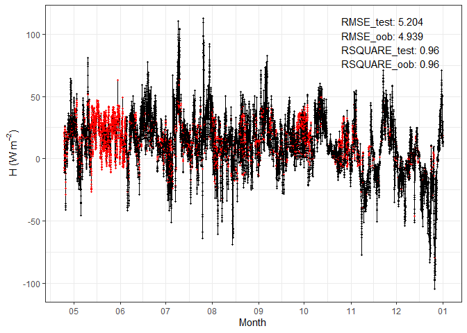

Using Random Forest for Eddy Covariance flux gap-filling
================
Felix Nieberding
2021-11-25

## Description

This Repo contains a function and use case for gap-filling Eddy
Covariance data using Random Forests algorithm (Breiman, 2001).

The function in *\_RF_impute_missing_fluxes.R* is basically a convenient
wrapper using `caret::train()` to perform gap-filling of input variables
using `randomForest::randomForest()`. It is based on the code provided
by [Yeonuk Kim](https://github.com/yeonukkim/EC_FCH4_gapfilling) based
on his recent publication in Global Change Biology (Kim et al., 2020).

The script *gap_filling.R* imports the data and sets the processing
options (e.g. mtry, n_trees, pre processing steps etc.) Then
*\_RF_impute_missing_fluxes.R* estimates the train parameters for every
(flux) variable to be filled on an annual basis. The script is performed
in parallel to increase computation time and can easily be adapted to
the number of cores available.

The other two scripts (*check_output.R* and *get_mtry.R*) can be used to
inspect model accuracies and results for mtry determination.

### Output

The function produces 4 different outputs in 3 different folders.

**./RF_models/mtry\_\[…\].csv:** Error metrics of mtry estimation, gets
only printed if train_mtry = TRUE

**./RF_models/mod_RF\_\[…\].rds:** The RF model itself.

**./RF_results/pred_RF\_\[…\].csv:** The results of gap-filling,
i.e. the original values, the gap-filling results, the residuals and a
column idicating if the values have been used for training only.

**./RF_plots/RF\_\[…\].png:** Plots showing the results of the
gap-filling and accuracy metrics.

**\[…\]:** several suffixes getting concatenated indicating the variable
which gets filled (\_Flux), the year (\_Year), the pre-processing method
(\_impute), the number of trees grown (\_N_trees) and a freely choosable
suffix (\_suffix).

### Example plot

<!-- -->

### References:

Breiman, L.: Random Forests, Machine Learning, 45, 5–32,
<doi:10.1023/A:1010933404324>, 2001.

Kim, Y., Johnson, M. S., Knox, S. H., Black, T. A., Dalmagro, H. J.,
Kang, M., Kim, J., and Baldocchi, D.: Gap-filling approaches for eddy
covariance methane fluxes: A comparison of three machine learning
algorithms and a traditional method with principal component analysis,
Global Change Biol, 26, 1499–1518, <doi:10.1111/gcb.14845>, 2020.
